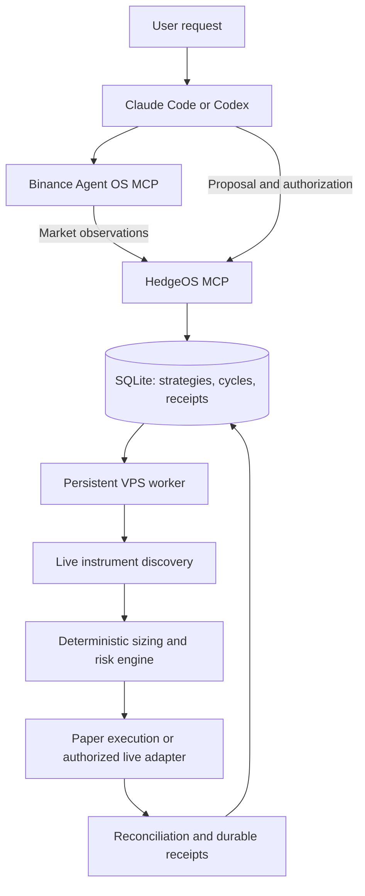

# HedgeOS

**Autonomous stock accumulation with a corresponding hedge, operated through Claude Code or Codex.**


Built for the Binance Agent OS Mini Hackathon · Track A — Agent Creation

HedgeOS turns a natural-language investment instruction into a persistent, exchange-aware strategy. Instead of manually repeating stock purchases, calculating a Futures hedge, and keeping a trading terminal open, users can configure a strategy once and let a dedicated worker manage the schedule, execution, and records.

> “Invest $100 in Nvidia every week for six months. Show me the proposal before activating it.”

The application validates the supported Binance bStock and matching TradFi perpetual, calculates the allocation, checks exchange minimums, and presents the strategy for confirmation. Its deterministic engine handles financial calculations; Claude Code or Codex provides the conversational operator interface.

**Current evidence:** Autonomous paper execution is verified on a persistent VPS, Binance Agent OS and HedgeOS MCP have been exercised with real tool calls, and a real NVDAB Spot purchase has been independently reconciled against Binance. The first live hedge was deferred by the exchange-minimum sizing policy, so a complete real-money hedged cycle is not yet verified. See [Live execution evidence](#live-execution-evidence) for the exact outcome.

## The problem

Recurring stock investing is easy to describe but harder to operate when the investor also wants a corresponding hedge. Each contribution needs instrument validation, exchange-aware sizing, funding, scheduling, execution, and reconciliation.

A short perpetual can offset some downside exposure, but it introduces its own margin, funding, basis, and liquidation risks. It is not insurance.

Most importantly, a chat session is not a persistent trading service. A useful agent must continue operating after the user closes Claude, preserve its state across restarts, and make partial executions and failures visible instead of pretending every cycle succeeded.

## The solution

HedgeOS combines a natural-language operator with a deterministic execution service:

* **Configure in plain English.** Choose a supported ticker, contribution amount, cadence, duration, and hedge leverage. The AI translates intent into a structured proposal; it does not decide trade quantities or override risk rules.
* **Allocate each contribution.** The default policy assigns 90% to the bStock and 10% to a hedge collateral budget. The hedge targets 2× that collateral budget by default, with 3× optional.
* **Respect the exchange.** Both legs are sized against live instrument filters using exact fixed-point arithmetic. Insufficient budgets are deferred rather than oversizing an order or increasing leverage to force execution.
* **Run independently.** A persistent worker manages due cycles, durable state, receipts, and restart recovery. Claude Code and Codex can be closed without stopping the worker.
* **Separate authorization from execution.** Paper and live strategies are distinct. Live creation, authorization, and execution are separate operations, with capital, schedule, credential, and funding gates.
* **Make outcomes inspectable.** The MCP tools and read-only dashboard expose strategies, execution history, receipts, deferred budgets, and risk alerts.

### Example allocation

For an illustrative $100 contribution at 2×, the policy assigns $90 to stock and $10 to hedge collateral, targeting approximately $20 of short notional before exchange filters, rounding, and fees.

That is a partial offset, not a full hedge or a guaranteed loss limit. Actual executable quantities may be smaller, and a leg may be deferred.

## How it works



**Binance Agent OS is an operator-side integration.** Real MCP calls provide market and account observations that HedgeOS can cross-check against its own discovery. The worker currently uses Binance's official REST APIs for market discovery and authenticated execution; it does not depend on an interactive Agent OS session staying open.

The official Binance Skill was also installed and its command surface inspected, but its CLI was not execution-verified or wired into the trading path. These are separate integration surfaces, not interchangeable claims.

The source of truth for money math is `src/engine/`. The source of truth for due-cycle execution is the persistent worker and shared database, not the language model.

## Verified evidence

### Autonomous paper execution

The founder's VPS ran an AAPL paper strategy with a $77 contribution and a configurable five-minute interval. A manually triggered cycle was followed by a second cycle fired by the worker's own tick without operator intervention. Both produced durable, explicitly simulated stock and hedge receipts.

| Evidence              | Verified result                                                       |
| --------------------- | --------------------------------------------------------------------- |
| Persistent scheduling | Worker-generated AAPL cycle without operator intervention             |
| Paper stock leg       | 0.218 AAPLB at approximately $316.48 in the autonomous cycle          |
| Paper hedge leg       | 0.04 AAPLUSDT short at approximately $316.56                          |
| Receipt labeling      | `mode=paper`, `simulated=1`                                           |
| Restart recovery      | Worker restarts and durable cycle reconciliation tested               |
| Claude Code           | HedgeOS MCP connected and exercised against deployed state            |
| Codex                 | Real MCP registration and read-only strategy/status calls verified    |
| Binance Agent OS      | Real price, exchange-information, and permission-tool calls exercised |
| Automated checks      | 214/214 tests and clean typecheck reported at commit `921f5ac`        |

Paper fills are simulations using real market prices. They are not exchange transactions. The full checkpoint history is retained in [PROGRESS_LOG.md](PROGRESS_LOG.md).

### Live execution evidence

**A real Spot purchase has been verified. A complete live stock-plus-hedge cycle has not.**

On September 8, 2026, a separately authorized, one-cycle-only live strategy executed against the founder's main Binance account. The resulting Spot fill was independently checked against exchange account and trade data, not merely inferred from a HedgeOS receipt.

| Item                       | Verified outcome                                   |
| -------------------------- | -------------------------------------------------- |
| Instrument                 | NVDABUSDT, BUY                                     |
| Filled quantity            | 0.135 NVDAB                                        |
| Average fill price         | $225.52                                            |
| Stock notional             | Approximately $30.45, plus approximately $0.03 fee |
| Hedge                      | Deferred before submission to Binance              |
| Automatic funding transfer | None occurred                                      |
| Futures position           | Zero at the post-execution verification            |
| Durable record             | Live execution with `simulated=0`                  |

The hedge was deferred because the budget was recalculated from the actual stock fill. Its target short notional was $6.76. At the observed Futures price and 0.01 quantity step, 0.03 contracts would have exceeded that target; flooring to 0.02 produced approximately $4.51 of notional, below the exchange's $5 minimum.

The engine therefore refused to force an oversized hedge. This real-world rounding-boundary case is covered by a regression test.

**The position remained unhedged at the last verified account read.** No subsequent recovery trade has been confirmed in this repository. The existing cycle is exhausted, and the current operator interface does not yet expose an independent `complete_deferred_hedge` operation for an already-filled stock leg. That is a concrete recovery limitation, not evidence of a completed hedge.

The live test verifies actual Spot order placement, fill reconciliation, durable recording, and the deferred-hedge safety path. It does not verify a live Futures fill, an actual automatic transfer, or unattended recurring real-money trading. Detailed evidence and historical investigation are in [LIVE_TRADING_READINESS.md](LIVE_TRADING_READINESS.md).

## Replicate the agent

HedgeOS is currently a self-hosted, single-user developer application. Each operator runs their own instance and uses their own account. It is not a public custodial platform, and other users should not connect to the founder's VPS.

### 1. Install and run the checks

Requirements: Git, a supported Node.js installation, npm, and internet access for Binance market data. For an always-on deployment, use a Linux VPS with SSH access. See [SELF_HOSTED_INSTALL.md](docs/SELF_HOSTED_INSTALL.md) for the complete server setup.

```bash
git clone https://github.com/Benita2001/HedgeOS.git
cd HedgeOS
npm install
npm test
npx tsc --noEmit
```

### 2. Run a one-off paper contribution

```bash
npx tsx scripts/paper-demo.ts NVDA 100 2
```

The arguments are ticker, contribution amount, and leverage. They are example values, not product constants. This demonstration uses live market data and simulated execution; it requires no trading credentials and places no real orders.

### 3. Start a persistent paper strategy

For a local worker demonstration:

```bash
npx tsx scripts/seed-strategy.ts AAPL 250 2 weekly
HEDGEOS_MODE=paper npx tsx src/worker/index.ts
```

Keep the worker running in its own terminal. The seed command is a demonstration helper; for a configurable natural-language strategy, use the MCP workflow below. The database retains strategy and cycle state across process restarts.

For an independent VPS deployment, follow the install guide and use your own host:

```bash
export HEDGEOS_DEPLOY_HOST=root@<your-host>
./deploy/deploy.sh
```

The deploy tooling installs a dedicated service user, an independent Node runtime, systemd services, and SQLite backups. The dashboard binds to loopback by default. Do not copy the founder's database, private environment files, or credentials.

### 4. Connect HedgeOS to Claude Code

From the repository directory, register the local stdio MCP server:

```bash
claude mcp add hedgeos --transport stdio -- npx tsx src/mcp/server.ts
```

Open Claude Code and use `/mcp` to confirm the connection. The MCP process must point to the same database as the worker. For remote operation, use the documented SSH-spawn pattern rather than exposing an unauthenticated public MCP port.

Codex setup is documented in [OPERATOR_GUIDE.md](docs/OPERATOR_GUIDE.md); local and remote details are in [MCP_SETUP.md](docs/MCP_SETUP.md).

### 5. Connect Binance Agent OS

Register Binance's official Agent OS MCP endpoint:

```bash
claude mcp add binance-mcp-server --transport http https://agent.binance.com/mcp/agentic
```

Complete the official authentication flow in your own client. The integration allows Claude to retrieve real Binance observations and pass them to HedgeOS for cross-checking.

Agent OS authentication and the main-account REST execution credentials are separate; do not assume the Agentic sub-account's balances or permissions represent the execution account.

### 6. Create a strategy through natural language

Ask Claude:

> Use HedgeOS to invest $100 in Nvidia every week for six months. Use paper mode and show me the proposal before creating it.

The operator should retrieve current observations, call `preview_with_agent_os_observations` when Agent OS is available, and present the structured strategy, exchange minimums, allocation, schedule, and funding requirements. After confirmation, use `create_paper_strategy` and inspect the result with `get_strategy_status` and `list_receipts`.

For a finite autonomous demonstration, choose a short interval and explicit end time. Close the AI client after a completed cycle, leave the worker running, and reconnect after the next due time to inspect the new receipt. This demonstrates the difference between a persistent agent and a chat-session script.

### 7. Inspect the dashboard

```bash
HEDGEOS_MODE=paper npx tsx src/dashboard/server.ts
```

Open `http://localhost:8766`. For a remote VPS, use the SSH tunnel described in the deployment guide. The dashboard is read-only and is not a substitute for exchange-confirmed account state.

## MCP operator tools

The current source exposes these operator capabilities:

| Purpose           | Tools                                                                                              |
| ----------------- | -------------------------------------------------------------------------------------------------- |
| Inspect           | `list_strategies`, `get_strategy_status`, `list_recent_cycles`, `list_executions`, `list_receipts` |
| Preview           | `preview_strategy`, `preview_with_agent_os_observations`, `check_funding_readiness`                |
| Paper operation   | `create_paper_strategy`, `trigger_due_cycle`                                                       |
| Strategy controls | `pause_strategy`, `resume_strategy`                                                                |
| Live operation    | `create_live_strategy`, `authorize_live_strategy`, `trigger_live_cycle`                            |

`create_live_strategy` persists a draft; it does not itself place an order. `authorize_live_strategy` is a separate authorization for autonomous recurrence. `trigger_live_cycle` invokes the real execution adapter only when its independent runtime gate passes.

**Mode selection:** Explicit paper requests must remain paper, and explicit real-money requests must be presented as live proposals. If intent is ambiguous, the operator should ask rather than silently create a paper or live strategy. An existing paper strategy is never silently converted into a live one.

## Live trading and funding

The live architecture includes authenticated Spot and USDⓈ-M Futures REST clients, leverage/margin configuration, actual-fill reconciliation, stable order identifiers, ambiguous-outcome recovery, capital limits, finite schedules, and separate automatic-funding controls.

These components have been tested, but the verified real-money evidence is limited to the Spot transaction described above.

Real-money use requires the operator's own eligible Binance account, supported instruments, sufficient funds, restricted API credentials, and explicit financial authorization. Start with [LIVE_PREFLIGHT_SETUP.md](docs/LIVE_PREFLIGHT_SETUP.md) and [LIVE_TRADING_READINESS.md](LIVE_TRADING_READINESS.md). Keep credentials in private, permission-restricted files; never paste them into chat or commit them to GitHub. Disable withdrawals and restrict API access to the intended host and required scopes.

Automatic funding is a separate capability. It is designed to transfer only the planned Spot-to-USDⓈ-M collateral shortfall within explicit caps. The implementation includes durable reservations and transfer reconciliation, but **an actual automatic funding transfer has not yet been verified**.

The old account-permission blocker was resolved in a later authenticated check; historical reports saying `permitsUniversalTransfer=false` are no longer the latest evidence. Permission changes, however, are not proof that a transfer has succeeded.

Do not activate live mode by casually changing a single environment variable. The worker and MCP execution context must use a coherent release and the documented live/funding gates. For real-money recovery, inspect actual positions and reconcile uncertain outcomes before considering another order.

The repository's historical, hardcoded controlled-cycle script is evidence of one authorized test, not a generic command that another user should run with their own funds.

## Engineering decisions

### Deterministic financial rules

The sizing engine uses BigInt fixed-point arithmetic and live exchange filters. It never raises leverage or rounds an order up merely to satisfy a minimum. A small contribution can create a valid stock leg while leaving the hedge deferred; that means the exposure is temporarily unhedged and must be reported as such.

### Persistence and idempotency

SQLite stores strategies, cycles, executions, receipts, and funding reservations. Due-cycle claims use durable state to prevent overlapping worker ticks and MCP triggers from executing the same slot twice. The worker reconciles interrupted cycles on startup and preserves confirmed fills when later legs fail.

### Funding isolation

The funding planner distinguishes stock spend, hedge target notional, collateral, fees, wallet balances, and deferred budgets. Atomic SQLite reservations protect against HedgeOS's own concurrent strategies claiming the same funds. They cannot prevent a separate manual trade or another application from changing the exchange balance between observations.

### Risk boundaries

The hedge is a matching short perpetual, not a promise of capital protection. Ordinary price movement does not trigger continuous hedge-ratio restoration. Funding rates, basis divergence, liquidation, slippage, and incomplete execution remain real risks. Isolated margin and the 10% collateral budget do not guarantee that total losses are capped at the contribution amount.

## Current scope and limitations

HedgeOS is a working single-tenant agent and a developer-oriented trading system, not a finished multi-user investment service. It does not provide hosted signup, per-user account isolation, or a public authenticated MCP endpoint. A multi-tenant architecture is documented separately, not implemented.

The principal remaining live-validation gaps are a completed exchange-confirmed Futures hedge, a real automatic funding transfer, and an independently verified unattended live recurring run. The current deferred-hedge recovery workflow also needs a dedicated operation that can complete an existing hedge without purchasing additional stock. These limitations are not hidden by the successful Spot proof.

## Documentation and source map

| Area                                      | Source                                                                         |
| ----------------------------------------- | ------------------------------------------------------------------------------ |
| Product policy                            | [PROJECT_PLAN.md](PROJECT_PLAN.md)                                             |
| Full build and test history               | [PROGRESS_LOG.md](PROGRESS_LOG.md)                                             |
| Live execution evidence and prerequisites | [LIVE_TRADING_READINESS.md](LIVE_TRADING_READINESS.md)                         |
| Operator workflow                         | [docs/OPERATOR_GUIDE.md](docs/OPERATOR_GUIDE.md)                               |
| MCP setup                                 | [docs/MCP_SETUP.md](docs/MCP_SETUP.md)                                         |
| Self-hosting                              | [docs/SELF_HOSTED_INSTALL.md](docs/SELF_HOSTED_INSTALL.md)                     |
| Binance Agent OS integration              | [docs/AGENT_OS_OPERATOR_WORKFLOW.md](docs/AGENT_OS_OPERATOR_WORKFLOW.md)       |
| Execution route rationale                 | [EXECUTION_ROUTE_DECISION.md](EXECUTION_ROUTE_DECISION.md)                     |
| Funding architecture                      | [docs/FUNDING_READINESS.md](docs/FUNDING_READINESS.md)                         |
| Official Skills assessment                | [docs/BINANCE_SKILLS_HUB_ASSESSMENT.md](docs/BINANCE_SKILLS_HUB_ASSESSMENT.md) |
| Multi-tenant design sketch                | [docs/MULTI_TENANT_ARCHITECTURE.md](docs/MULTI_TENANT_ARCHITECTURE.md)         |

The application source is organized under `src/engine`, `src/binance`, `src/observations`, `src/db`, `src/scheduler`, `src/worker`, `src/mcp`, `src/risk`, and `src/dashboard`. The repository includes tests and self-hosted deployment tooling. No credentials, live account access, or founder-hosted service are required to reproduce the paper demonstration.

---

HedgeOS is open source for inspection and self-hosted experimentation. Use real money only with an understanding of the risks and the applicable Binance product and jurisdiction requirements. Nothing in this repository guarantees investment returns, downside protection, or recovery of collateral.
